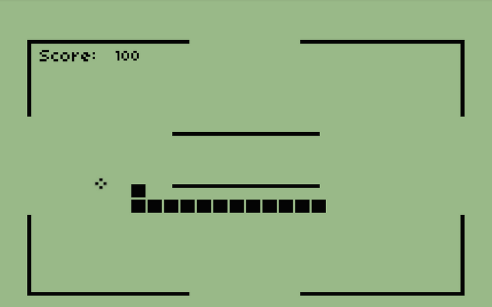

# A blockchain from scratch

The goal of this project is to create a fully functionnal blockchain platform written in Javascript.

## Table of contents

1. [Quick introduction to blockchain technology](#Quick introduction to blockchain technology)
2. [Building the data structure](#Building the data structure)
3. [Interacting with the API](#Interacting with the API)
4. [Building the network](#Building the network)
5. [Synchronization and Consensus](#Synchronization and Consensus)
6. [Usefulness of Blockchain technology](#Usefulness of Blockchain technology)
7. [Customization of the blockchain](#Customization of the blockchain)

### Quick introduction to blockchain technology

First, what is blockchain ? It is a technology that enables a decentralized and secure storage and transfer of informations between nodes in a network.

It's structure is inspired from its name, it is a chain of blocks shared identicaly between all the nodes of the network.

One can visualize it by seeing the famous snake in the Nokia 3310 game. As we go through the game and eat more apples, the blockchain also add more blocks to the chain.

 <em> The snake game running on a Nokia 3310</em> 

The act of adding a block to the chain is called mining.  

### Building the data structure

I will use classes instead of prototypes in order to build the blockchain in Javascript. Although it is considered as a syntaxic sugar, I believe that using classes would be more comprehensive to the common reader that I assume is not introduced to Javascript concepts. 

### Interacting with the API

### Building the network

Speak about the most principle endpoint : register and broadcast node.

### Synchronization and Consensus 

The consensus method used is called : Length of chain

### Usefulness of Blockchain technology

### Security issues 

In order to speak about the security issues of the blockchain, we must first see how blockchain is made secure.

Since the goal is to make it hard if not impossible for an attacker to add an illegitimate operation to one of the existing blocks, a hash is computed for every block. The hash makes the task harder for the attacker for two reasons :

- Generating a hash for one block requires the hash from the previous block. Thus, if an attacker wants to change a block's hash, he will also have to change the hash of all the next blocks. Adding to that, since there a consensus protocol between the nodes of the network, it is highly probable that his mining query will be refused and that he will be excluded from the network.

- Generating a hash requires important computational ressources using the Proof of Work method.

However, there exists some attacks to which the blockchain is vulnerable. Here are briefly introduced some of the attacks :

- 51% attack : Also known as the Goldfinger attack, it exists thanks to the consensus  protocol that is used. If there exists a group of attackers which control 51% of the computing power, thing which is highly cost intensive, they will be able to validate or reject any operations they want since they have the authority to do so. This leads the hackers to do what is called a double spending attack, which is presented next.  

- Double spending attack : 

- Selfish miner attack : In a mining group, the attacker node decides not to broadcast the newly mined block and instead starts mining the upcoming block.

- Eclipse attack : Isolate a node from the network and make it believe it recieves correct data from other nodes

### Customization of the blockchain

- Error handling
- Amount verification
- Comment of the code
